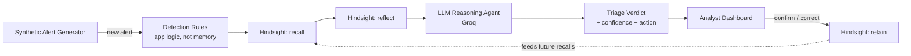

# Aegis — A Memory-Powered Account Takeover (ATO) Detection Agent

Built for **HackWithHyderabad 3.0** — "AI Agents That Learn Using Hindsight"

## The Problem

SOC (Security Operations Center) analysts triage account-takeover alerts (weird logins,
impossible travel, brute-force attempts, MFA-bypass attempts) with **no memory of past
incidents**. Every alert is investigated from scratch, even when the exact same attacker
pattern, IP range, or behavior signature has shown up before. This wastes analyst time and
lets confirmed-bad patterns slip through as "unknown / needs investigation" every single time.

## The Solution

**Aegis** is a triage agent that sits in front of raw login-anomaly alerts. For every new
alert it:

1. **Recalls** similar past incidents from Hindsight (same IP/ASN, same behavior signature,
   same targeted user or department, same attacker TTP).
2. **Reasons** over the alert + recalled memories with an LLM to produce a verdict
   (`malicious` / `benign` / `needs_review`), a confidence score, and a recommended
   containment action.
3. **Learns** from analyst feedback — every resolved incident (confirmed breach, false
   positive, or corrected verdict) is written back into Hindsight, so the next similar alert
   is triaged faster and more accurately.

The demo shows the agent going from generic guesses on early alerts to confident,
cited, "we've seen this exact attacker before" triage by the 10th–20th alert.

## Architecture



**What lives in Hindsight (the memory layer):**
- Every resolved incident: alert signature, IP/geo, targeted user, verdict, action taken,
  outcome, analyst notes.
- Analyst corrections ("this was actually a false positive, user was traveling") — so the
  agent stops over-flagging that pattern.

**What is plain app logic (not memory):**
- The heuristic rules that flag a raw login event as worth investigating in the first place
  (impossible travel, new device + odd hour, brute force, credential stuffing).
- The dashboard / API / LLM prompt orchestration.
- The "live" alert currently being triaged, before it's resolved and written to memory.

## Tech Stack

- **Memory**: [Hindsight](https://hindsight.vectorize.io/) (`hindsight-client`)
- **LLM**: Groq (`openai/gpt-oss-120b`, free tier) — swap via `.env`
- **Backend**: FastAPI (Python)
- **Frontend**: Single-page vanilla JS dashboard (no build step)

## Setup

### 1. Run Hindsight (pick one)

**Option A — Hindsight Cloud** (fastest):
1. Sign up at https://ui.hindsight.vectorize.io
2. Apply promo code `MEMHACK99` in Billing for $50 free credits
3. Go to **Connect** → copy your API endpoint + API key

**Option B — Self-hosted (Docker)**:
```bash
export OPENAI_API_KEY=sk-xxx
docker run --rm -it --pull always -p 8888:8888 -p 9999:9999 \
  -e HINDSIGHT_API_LLM_API_KEY=$OPENAI_API_KEY \
  -v $HOME/.hindsight-docker:/home/hindsight/.pg0 \
  ghcr.io/vectorize-io/hindsight:latest
```
API will be at `http://localhost:8888`.

### 2. Get a Groq API key

Free tier at https://groq.com — used for the reasoning/triage step.

### 3. Configure

```bash
cd backend
cp .env.example .env
# edit .env with your HINDSIGHT_BASE_URL, HINDSIGHT_API_KEY (cloud only), GROQ_API_KEY
```

### 4. Install & run

```bash
pip install -r requirements.txt
python main.py
```

Backend runs at `http://localhost:8000`.

### 5. Open the dashboard

Open `frontend/index.html` directly in your browser (it talks to `localhost:8000`).

### 6. Seed history + run the demo

```bash
# from backend/
python synthetic_data.py --seed        # pre-loads 15 historical resolved incidents into Hindsight
```

Then in the dashboard, click **"Generate Next Alert"** repeatedly and watch the agent's
confidence and citations grow as more alerts get resolved.

## Demo Script (60 seconds)

See [`demo_script.md`](./demo_script.md).

## Judging Criteria Mapping

| Criteria | How this project addresses it |
|---|---|
| Innovation (30%) | Security/SOC framing of "incident response" instead of the generic DevOps-outage interpretation; case-based reasoning over attacker patterns |
| Use of Hindsight Memory (25%) | Every verdict is grounded in `recall()` + `reflect()`; every resolution writes back via `retain()`; memory is visibly cited in the UI, not hidden |
| Technical Implementation (20%) | Clean separation of detection rules (app logic) vs. memory (Hindsight) vs. reasoning (LLM); handles function-calling / LLM errors gracefully |
| User Experience (15%) | Single dashboard, one click to advance the demo, memory citations shown inline |
| Real-world Impact (10%) | Directly maps to a real SOC pain point (alert fatigue, repeated investigation of known-bad patterns) |

## Project Structure

```
soc-memory-agent/
├── README.md
├── demo_script.md
├── backend/
│   ├── main.py                 # FastAPI app + endpoints
│   ├── config.py                # env/config loading
│   ├── hindsight_wrapper.py     # retain / recall / reflect wrapper
│   ├── llm_agent.py             # Groq reasoning agent
│   ├── detection_rules.py       # heuristic alert-generation logic (app logic, not memory)
│   ├── synthetic_data.py        # synthetic users/alerts + history seeding
│   ├── requirements.txt
│   └── .env.example
└── frontend/
    └── index.html                # dashboard (vanilla JS)
```
